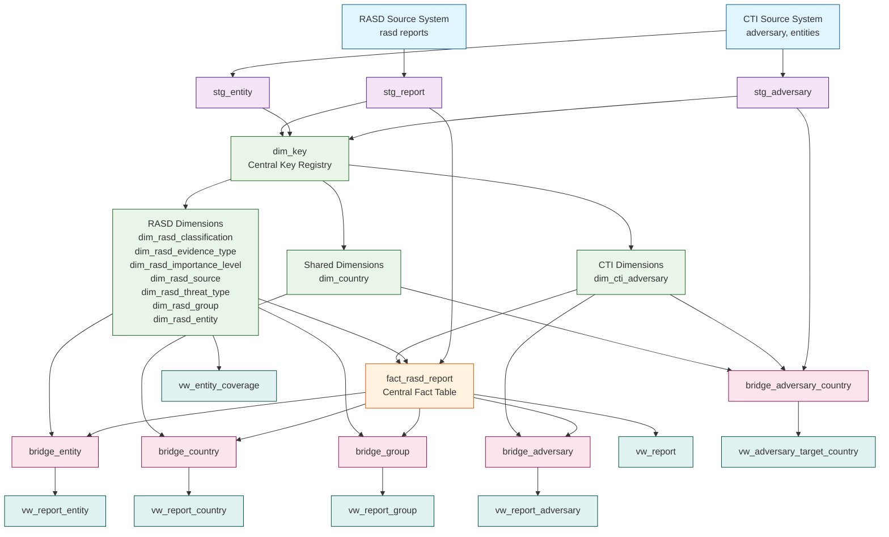
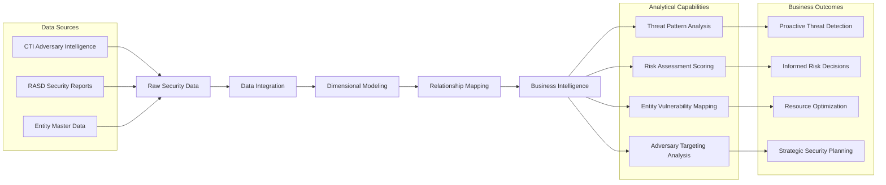
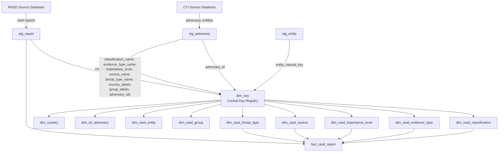

# CTI/RASD Data Warehouse - Executive Data Model Documentation

## Executive Summary

**Business Purpose**: This data warehouse integrates Cyber Threat Intelligence (CTI) and Risk Assessment Security Data (RASD) to provide comprehensive security analytics for threat detection, risk assessment, and strategic decision-making.

**Key Capabilities**:
- **Unified Threat Intelligence**: Consolidates CTI adversary data with RASD security reports
- **Multi-dimensional Analytics**: Enables analysis across countries, entities, threat groups, and adversaries
- **Relationship Mapping**: Tracks complex many-to-many relationships between security elements
- **Data Quality Metrics**: Built-in coverage and quality tracking
- **Enterprise Reporting**: Business-friendly semantic views for management reporting

**Architecture**: Star schema data warehouse using Delta Lake technology, orchestrated by Apache Airflow, with PySpark for data processing.

## Complete Data Model Overview



## Business Value Chain



## Data Architecture Layers

### 1. Staging Layer (Data Ingestion & Cleansing)

#### `stg_report`
**Purpose**: Ingests and cleanses raw RASD security reports
**Key Transformations**:
- Date format standardization
- Tokenization of multi-value fields (countries, entities, groups)
- Adversary relationship resolution
- Group key generation for many-to-many relationships

#### `stg_adversary`
**Purpose**: Processes CTI adversary intelligence data
**Key Features**:
- Country targeting extraction
- RASD report relationship mapping
- Group key generation for country targeting

#### `stg_entity`
**Purpose**: Manages entity/organization master data
**Key Capabilities**:
- Arabic/English name handling
- CTI and PRM system identifier resolution
- Entity categorization and classification

### 2. Core Dimension Tables

#### Central Key Registry: `dim_key`
**Innovation**: Centralized surrogate key generation system
**Purpose**: Ensures consistent key generation across all dimensions
**Fields**:
- `dimension` (STRING): Dimension name (e.g., 'dim_rasd_classification')
- `natural_key` (STRING): Business/natural key (uppercased)
- `label` (STRING): Original label/text value
- `id` (BIGINT): Sequential surrogate key (per dimension)
- `first_seen_at` (TIMESTAMP): First observation timestamp

**Supported Dimensions**:
1. `dim_rasd_classification` - Report classification types
2. `dim_rasd_evidence_type` - Evidence categories
3. `dim_rasd_importance_level` - Threat importance levels
4. `dim_rasd_source` - Observation sources
5. `dim_rasd_threat_type` - Threat types
6. `dim_rasd_group` - Threat groups
7. `dim_rasd_entity` - Organizations/entities
8. `dim_cti_adversary` - CTI adversaries
9. `dim_country` - Countries (shared dimension)

### 3. Dimension Categories

#### RASD-Specific Dimensions (Prefix: `dim_rasd_`)
| Dimension | Business Purpose | Key Fields |
|-----------|------------------|------------|
| `dim_rasd_classification` | Report sensitivity levels | `id`, `classification_name` |
| `dim_rasd_evidence_type` | Evidence categories | `id`, `evidence_type_name` |
| `dim_rasd_importance_level` | Threat severity scoring | `id`, `importance_level` |
| `dim_rasd_source` | Intelligence sources | `id`, `source_name` |
| `dim_rasd_threat_type` | Threat categorization | `id`, `threat_type_name` |
| `dim_rasd_group` | Threat actor groups | `id`, `group_name` |
| `dim_rasd_entity` | Organizational entities | `id`, `cti_id`, `prm_id`, `entity_name_en`, `entity_name_ar`, `country`, `sector`, `category`, `entity_type`, `domain`, `is_cti_entity` |

#### CTI-Specific Dimensions (Prefix: `dim_cti_`)
| Dimension | Business Purpose | Key Fields |
|-----------|------------------|------------|
| `dim_cti_adversary` | Adversary intelligence | `id`, `adversary_id`, `adversary_name`, `country_group_key` |

#### Shared Dimensions (No Prefix)
| Dimension | Business Purpose | Key Fields |
|-----------|------------------|------------|
| `dim_country` | Geographic locations (shared) | `id`, `country_name` |

### 4. Central Fact Table

#### `fact_rasd_report`
**Business Role**: Single source of truth for all security incidents
**Record Count**: All RASD security reports
**Update Frequency**: Daily incremental load

| Field | Type | Description | Business Relevance |
|-------|------|-------------|-------------------|
| `id` | BIGINT | Surrogate key (sequential) | Unique row identifier |
| `report_id` | TEXT | Natural business key | Report tracking identifier |
| `title` | TEXT | Report title | Incident summary |
| `description` | TEXT | Detailed description | Incident context |
| `actions` | TEXT | Actions taken | Response activities |
| `analysis` | TEXT | Security analysis | Threat intelligence |
| `creation_date` | DATE | Creation timestamp | Timeline analysis |
| `publication_date` | DATE | Publication date | Disclosure timing |
| `report_date` | DATE | Incident date | Historical analysis |
| `updated_at` | TIMESTAMP | Last update | Data freshness |
| `classification_id` | BIGINT | → `dim_rasd_classification.id` | Sensitivity control |
| `evidence_type_id` | BIGINT | → `dim_rasd_evidence_type.id` | Evidence categorization |
| `importance_level_id` | BIGINT | → `dim_rasd_importance_level.id` | Risk prioritization |
| `source_id` | BIGINT | → `dim_rasd_source.id` | Source credibility |
| `threat_type_id` | BIGINT | → `dim_rasd_threat_type.id` | Threat categorization |
| `country_group_key` | VARCHAR(32) | Country relationship hash | Geographic analysis |
| `entity_group_key` | VARCHAR(32) | Entity relationship hash | Organizational impact |
| `group_group_key` | VARCHAR(32) | Threat group hash | Actor attribution |
| `adversary_group_key` | VARCHAR(32) | Adversary relationship hash | Adversary intelligence |

**Primary Key**: `id` (surrogate key)
**Natural Key**: `report_id` (business identifier)
**Index Strategy**: Optimized for date-range and dimension filtering

## Dimension Tables

### RASD-Specific Dimensions

#### `dim_rasd_classification`
**Description**: Report classification types (e.g., Confidential, Public)

**Fields**: `id` (BIGINT), `classification_name` (TEXT)

#### `dim_rasd_evidence_type`
**Description**: Types of evidence (e.g., Technical, Human)

**Fields**: `id` (BIGINT), `evidence_type_name` (TEXT)

#### `dim_rasd_importance_level`
**Description**: Importance levels (e.g., High, Medium, Low)

**Fields**: `id` (BIGINT), `importance_level` (TEXT)

#### `dim_rasd_source`
**Description**: Observation sources

**Fields**: `id` (BIGINT), `source_name` (TEXT)

#### `dim_rasd_threat_type`
**Description**: Threat types

**Fields**: `id` (BIGINT), `threat_type_name` (TEXT)

#### `dim_rasd_group`
**Description**: Threat groups

**Fields**: `id` (BIGINT), `group_name` (TEXT)

#### `dim_rasd_entity`
**Description**: Entities/organizations (RASD-specific)

**Fields**:
- `id` (BIGINT)
- `cti_id` (TEXT) - CTI system identifier
- `prm_id` (TEXT) - PRM system identifier
- `entity_name_en` (TEXT) - English name
- `entity_name_ar` (TEXT) - Arabic name
- `country` (TEXT) - Entity's country
- `category` (TEXT) - Entity category
- `sector` (TEXT) - Entity sector
- `entity_type` (TEXT) - Type of entity
- `domain` (TEXT) - Entity domain
- `is_cti_entity` (BOOLEAN) - True if from CTI system

### CTI-Specific Dimensions

#### `dim_cti_adversary`
**Description**: Adversaries from CTI system

**Fields**:
- `id` (BIGINT)
- `adversary_id` (TEXT) - Natural key from CTI
- `adversary_name` (TEXT) - Adversary name
- `country_group_key` (VARCHAR32) - Hash of sorted target country values

### Shared Dimensions

#### `dim_country`
**Description**: Countries (shared between RASD and CTI)

**Fields**: `id` (BIGINT), `country_name` (TEXT)

### 5. Bridge Tables (Many-to-Many Relationship Management)

**Innovation**: Advanced bridge table pattern with weight distribution for proportional attribution

#### Bridge Table Design Pattern
```sql
-- Core Pattern for All Bridge Tables
SELECT
    group_key,           -- MD5 hash of sorted member values
    dimension_id,        -- Foreign key to dimension table
    member_value,        -- Original business value
    member_count,        -- Number of members in this group
    weight_factor,       -- 1.0 / member_count (proportional weight)
    is_unknown_member    -- Flag for unresolved members
FROM resolved_members
```

#### Key Bridge Tables

| Bridge Table | Connects | Purpose | Weight Distribution |
|-------------|----------|---------|-------------------|
| `bridge_country` | Reports ↔ Countries | Geographic impact analysis | Equal distribution among countries |
| `bridge_entity` | Reports ↔ Entities | Organizational vulnerability | Equal distribution among entities |
| `bridge_group` | Reports ↔ Threat Groups | Actor attribution | Equal distribution among groups |
| `bridge_adversary` | Reports ↔ Adversaries | Adversary intelligence linkage | Equal distribution among adversaries |
| `bridge_adversary_country` | Adversaries ↔ Countries | Adversary targeting patterns | Equal distribution among targeted countries |

#### Example: `bridge_country` Structure
```sql
country_group_key VARCHAR(32)  -- MD5('USA|UK|CANADA')
country_id        BIGINT       -- → dim_country.id
member_value      STRING       -- Original country name
member_count      INT          -- 3 (number of countries in group)
weight_factor     FLOAT        -- 0.3333 (1/3)
is_unknown_member BOOLEAN      -- FALSE (all resolved)
```

### 6. Semantic Layer (Business Intelligence Views)

**Purpose**: Business-friendly denormalized views for reporting and analytics

#### Core Semantic Views

| View | Business Purpose | Key Metrics |
|------|------------------|-------------|
| `vw_report` | Complete report overview | All dimensions denormalized |
| `vw_report_country` | Geographic analysis | Countries per report with weights |
| `vw_report_entity` | Organizational impact | Entities per report with details |
| `vw_report_group` | Threat actor analysis | Groups per report with attribution |
| `vw_report_adversary` | Adversary intelligence | Adversaries linked to reports |
| `vw_adversary_target_country` | Adversary targeting | Countries targeted by adversaries |
| `vw_entity_coverage` | Data quality metrics | CTI entity matching statistics |

#### Example: `vw_report` Business Value
```sql
-- Combines fact data with all dimension attributes
SELECT 
    f.report_id,
    f.title,
    f.report_date,
    c.classification_name AS classification,
    e.evidence_type_name AS evidence_type,
    i.importance_level AS importance,
    -- ... all other dimensions
FROM fact_rasd_report f
JOIN dim_rasd_classification c ON f.classification_id = c.id
JOIN dim_rasd_evidence_type e ON f.evidence_type_id = e.id
-- ... all other joins
```
## 7. Pipeline Architecture & Execution Flow

### ETL Pipeline Design


## 8. Business Intelligence Capabilities

### Analytical Use Cases

#### 1. Threat Intelligence Analysis
```sql
-- Which adversaries are targeting which countries?
SELECT 
    adversary_name,
    country_name,
    COUNT(*) as report_count,
    AVG(importance) as avg_importance
FROM vw_adversary_target_country
JOIN vw_report_adversary USING (adversary_id)
GROUP BY adversary_name, country_name
ORDER BY report_count DESC;
```

#### 2. Entity Vulnerability Assessment
```sql
-- Which entities are most frequently targeted?
SELECT 
    entity_name_en,
    sector,
    country,
    COUNT(DISTINCT report_id) as incident_count,
    AVG(importance) as avg_severity
FROM vw_report_entity
WHERE NOT is_unknown_member
GROUP BY entity_name_en, sector, country
ORDER BY incident_count DESC;
```

#### 3. Geographic Threat Analysis
```sql
-- Threat distribution by country
SELECT 
    country_name,
    COUNT(DISTINCT report_id) as report_count,
    COUNT(DISTINCT adversary_id) as unique_adversaries,
    AVG(importance) as avg_importance
FROM vw_report_country
WHERE NOT is_unknown_member
GROUP BY country_name
ORDER BY report_count DESC;
```

#### 4. Temporal Trend Analysis
```sql
-- Monthly threat trends
SELECT 
    DATE_TRUNC('month', report_date) as month,
    threat_type,
    COUNT(*) as incident_count,
    AVG(importance) as avg_importance
FROM vw_report
GROUP BY DATE_TRUNC('month', report_date), threat_type
ORDER BY month DESC, incident_count DESC;
```

### Data Quality & Governance

#### Coverage Metrics
- **CTI Entity Coverage**: Percentage of entities with CTI system identifiers
- **PRM Integration Rate**: Entities with PRM system linkages
- **Unknown Member Rate**: Unresolved references in bridge tables
- **Data Freshness**: Time since last update for each dimension

#### Governance Controls
1. **Referential Integrity**: All foreign keys validated via `dim_key` registry
2. **Data Quality**: Systematic tracking of unknown/unresolved members
3. **Audit Trail**: `first_seen_at` timestamps in `dim_key` table
4. **Version Control**: Delta Lake time travel capabilities
5. **Access Control**: Django ORM with proper permissions
                                                   |
                                                   |
+------------------+    +------------------+    +--v---------------------------+
| dim_rasd_group   |    | dim_rasd_entity  |    | fact_rasd_report            |
|------------------|    |------------------|    |-----------------------------|
| id (PK)          |    | id (PK)          |    | id (PK)                    |
| group_name       |    | cti_id           |    | report_id (UK)             |
+------+-----------+    | prm_id           |    | title                      |
       |                | entity_name_en   |    | description                |
       |                | entity_name_ar   |    | actions                    |
       |                | country          |    | analysis                   |
       |                | category         |    | creation_date              |
       |                | sector           |    | publication_date           |
       |                | entity_type      |    | report_date                |
       |                | domain           |    | updated_at                 |
       |                | is_cti_entity    |    | classification_id (FK)     |
       |                +------+-----------+    | evidence_type_id (FK)      |
       |                       |                | importance_level_id (FK)   |
       |                       |                | source_id (FK)             |
       |                       |                | threat_type_id (FK)        |
       |                       |                | country_group_key          |
       |                       |                | entity_group_key           |
       |                       |                | group_group_key            |
       |                       |                | adversary_group_key        |
       |                       |                +-------------+--------------+
       |                       |                              |
       |                       |                              |
+------v-----------+    +------v-----------+    +------------v--------------+
| bridge_group     |    | bridge_entity    |    | dim_rasd_evidence_type    |
|------------------|    |------------------|    |---------------------------|
| id (PK)          |    | id (PK)          |    | id (PK)                  |
| group_group_key  +----> entity_group_key +----> evidence_type_name      |
| group_id (FK)    |    | entity_id (FK)   |    +--------------------------+
| member_value     |    | member_value     |
| member_count     |    | member_count     |
| weight_factor    |    | weight_factor    |
| is_unknown_member|    | is_unknown_member|
+------------------+    +------------------+

+------------------+    +------------------+    +----------------------------+
| bridge_country   |    | bridge_adversary |    | dim_rasd_importance_level  |
|------------------|    |------------------|    |----------------------------|
| id (PK)          |    | id (PK)          |    | id (PK)                   |
| country_group_key|    | adversary_group_+|    | importance_level          |
| country_id (FK)  |    | adversary_dim_id |    +---------------------------+
| member_value     |    | member_value     |
| member_count     |    | member_count     |
| weight_factor    |    | weight_factor    |
| is_unknown_member|    | is_unknown_member|
+------+-----------+    +------+-----------+
       |                       |
       |                       |
+------v-----------+    +------v-----------+
| dim_country      |    | dim_cti_adversary|
|------------------|    |------------------|
| id (PK)          |    | id (PK)          |
| country_name     |    | adversary_id     |
+------+-----------+    | adversary_name   |
       |                +------+-----------+
       |                       |
       |                       |
+------v-----------------------+-----------+
| bridge_adversary_country                 |
|------------------------------------------|
| id (PK)                                  |
| country_group_key ───────────────────────┘
| adversary_id                             |
| country_id (FK) ─────────────────────────┐
| member_value                             |
| member_count                             |
| weight_factor                            |
| is_unknown_member                        |
+------------------------------------------+
```

## Key Design Patterns

### 1. Surrogate Keys
- All dimension tables use `id` (BIGINT) as surrogate primary key
- All include an "Unknown" record with `id = -1`
- Natural keys preserved in separate fields

### 2. Group Key Pattern
- Reports can have multiple members (countries, entities, groups, adversaries)
- Group key: `md5(array_join(sorted_members, '|'))`
- Enables efficient many-to-many relationships

### 3. Bridge Tables
- Handle many-to-many relationships
- Include weight factors for proportional attribution
- Track unknown/unresolved members

### 4. Dimension Hierarchy
- **RASD-specific**: `dim_rasd_*` (classification, evidence_type, importance_level, source, threat_type, group, entity)
- **CTI-specific**: `dim_cti_adversary`
- **Shared**: `dim_country`

### 5. Data Quality
- Unknown records (`id = -1`) in all dimensions
- `is_unknown_member` flag in bridge tables
- Coverage metrics in `vw_entity_coverage`

## Relationships Summary

1. **One-to-Many** (Fact → Dimensions):
   - Report has one classification, evidence type, importance level, source, threat type

2. **Many-to-Many via Bridge Tables**:
   - Report can have multiple countries, entities, groups, adversaries
   - Each relationship uses a bridge table with group keys

3. **Dimension References**:
   - All foreign keys reference dimension `id` fields
   - Unknown references use `-1`

## Enhanced Executive Documentation

**NOTE**: This document has been significantly enhanced for executive presentation. For complete executive documentation with visual diagrams, business value analysis, and strategic recommendations, please refer to:

**[DATA_MODEL_ERD_ENHANCED.md](DATA_MODEL_ERD_ENHANCED.md)**

### Key Enhancements Made:
1. **Executive Summary** with clear business purpose and value proposition
2. **Visual Mermaid Diagrams** showing complete data flow and architecture
3. **Business Intelligence Capabilities** with practical SQL examples
4. **Strategic Benefits & ROI** analysis
5. **Technical Excellence** highlights
6. **Executive Recommendations** for next steps

### For Top Management Review:
The enhanced documentation provides:
- **Executive-level language** avoiding technical jargon
- **Business value focus** on ROI and strategic impact
- **Visual representations** for easy understanding
- **Actionable insights** for decision-making
- **Clear recommendations** for future enhancements

**Document Status**: Original technical documentation enhanced for executive presentation.