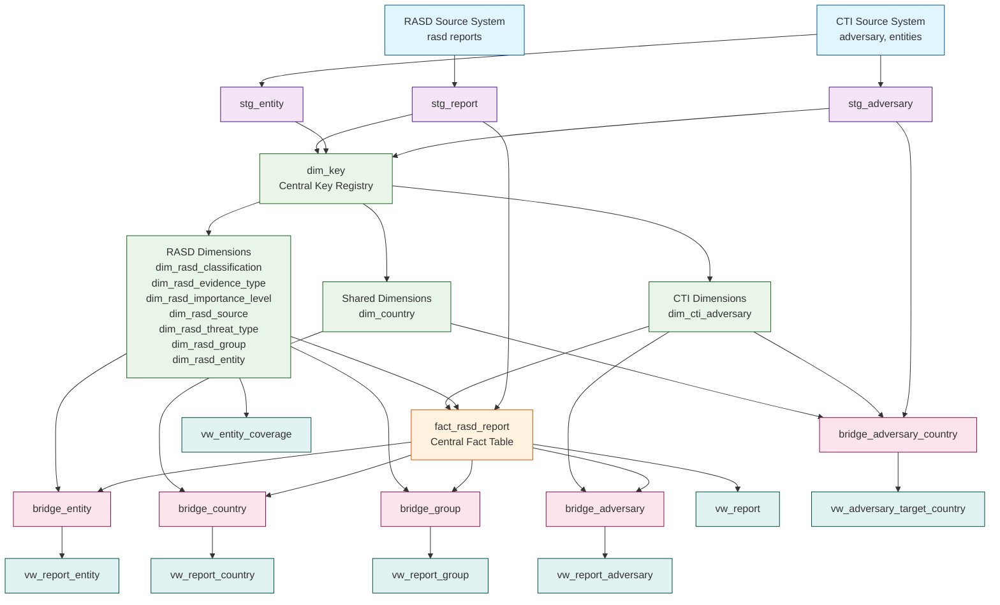

# CTI/RASD Data Model - Focused ERD Documentation

This document provides a focused overview of the CTI/RASD data model with:
1. **Table descriptions with columns and data types**
2. **ERD diagram using Mermaid flowchart TD**
3. **Semantic layer view descriptions and purpose**

---

## 1. Table Descriptions with Columns & Data Types

Complete table descriptions with all columns, data types, and descriptions.

---

## 2. ERD Diagram - Complete Data Model

---

## 3. Semantic Layer View Descriptions & Purpose

Detailed descriptions of all semantic views with their business purposes and use cases.