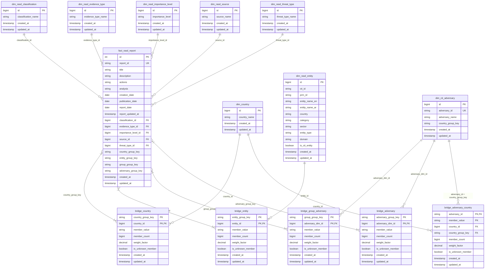

# CTI / RASD — Data Model

This document describes the data model in the `cti_gold` schema: the entity-relationship diagram, every model table, and the semantic views built on top of them.

The model is a star schema. One fact table holds the RASD threat reports, dimension tables hold the descriptive values a report points at, and bridge tables carry the relationships where a report has more than one of something. It is built daily by an Airflow DAG that stages the raw CTI and RASD data, registers surrogate keys, then rebuilds the dimensions, the fact table, the bridges and the views in that order.

Two conventions run through the whole model:

- **Surrogate keys come from a central registry.** A shared key table hands out the numeric `id` for every dimension value and remembers when it first saw that value, so an id stays with its value even though the tables themselves are rebuilt from scratch each run. Values are matched without regard to letter case. Every dimension also carries an Unknown row with an id of `-1`, which is what the fact and bridges point at when the source value is missing or cannot be matched. No foreign key is ever null.
- **Multi-valued relationships go through group keys.** A report can name several countries, entities, threat groups and adversaries. Each of those sets is hashed into a group key stored on the fact row, and the matching bridge table holds one row per group key and member. Reports naming the same set share a key, which keeps the bridges small. Each bridge row carries a `weight_factor` of one divided by the number of members, so a report's rows always add up to 1.

## 1. Entity-Relationship Diagram

The adversary dimension is reached three ways: from the report's own threat group names, from the CTI side where an adversary lists the reports it relates to, and from adversary country targeting. There is no separate threat group dimension, because a report's threat group is an adversary.

## 2. Model Tables

### 2.1 Fact

#### fact_rasd_report

One row per RASD threat report, and the centre of the model. It carries the report's text and dates, a foreign key for each of the five attributes a report has exactly one of, and a group key for each relationship where a report can have many. Reports come from the RASD source filtered to the report type of the same name, and the table is rebuilt in full on every run. Its `report_id` is the identifier to join on or store; the numeric `id` is renumbered each run.

| Column | Data Type | Description |
|---|---|---|
| id | INT | Report surrogate key, renumbered on every run. |
| report_id | STRING | RASD report identifier, stable across runs. |
| title | STRING | Report title. |
| description | STRING | Report description. |
| actions | STRING | Recommended or taken actions. |
| analysis | STRING | Analyst assessment. |
| creation_date | DATE | Date the report was created. |
| publication_date | DATE | Date the report was published. |
| report_date | DATE | Report observation date. |
| report_updated_at | TIMESTAMP | Last time the report changed in the source system. |
| classification_id | BIGINT | Reference to dim_rasd_classification. |
| evidence_type_id | BIGINT | Reference to dim_rasd_evidence_type. |
| importance_level_id | BIGINT | Reference to dim_rasd_importance_level. |
| source_id | BIGINT | Reference to dim_rasd_source. |
| threat_type_id | BIGINT | Reference to dim_rasd_threat_type. |
| country_group_key | STRING | Key of the report's country set in bridge_country. |
| entity_group_key | STRING | Key of the report's entity set in bridge_entity. |
| group_group_key | STRING | Key of the report's threat group set in bridge_group_adversary. |
| adversary_group_key | STRING | Key of the report's adversary set in bridge_adversary. |
| created_at | TIMESTAMP | Time the row was built by the latest pipeline run. |
| updated_at | TIMESTAMP | Time the row was last refreshed by the pipeline. |

### 2.2 Dimensions

Each dimension holds the distinct values of one attribute, one row per value, plus an Unknown row with an id of `-1`. Values are registered the first time they are seen and keep their id from then on, which is what `created_at` records.

#### dim_rasd_classification

The classification levels a report can carry, describing how sensitive it is. Values come from the report's own classification field, with empty and placeholder text treated as missing.

| Column | Data Type | Description |
|---|---|---|
| id | BIGINT | Classification surrogate key. |
| classification_name | STRING | Classification name. |
| created_at | TIMESTAMP | Time the value was first registered. |
| updated_at | TIMESTAMP | Time the row was last refreshed by the pipeline. |

#### dim_rasd_evidence_type

The kinds of evidence that back a report, taken from the report's evidence type field. Useful for judging how well supported a body of reports is.

| Column | Data Type | Description |
|---|---|---|
| id | BIGINT | Evidence type surrogate key. |
| evidence_type_name | STRING | Evidence type name. |
| created_at | TIMESTAMP | Time the value was first registered. |
| updated_at | TIMESTAMP | Time the row was last refreshed by the pipeline. |

#### dim_rasd_importance_level

The importance levels assigned to reports. The level is text, and ids follow the order values were first seen rather than any ranking, so sort by the label and not by the id.

| Column | Data Type | Description |
|---|---|---|
| id | BIGINT | Importance level surrogate key. |
| importance_level | STRING | Importance level name. |
| created_at | TIMESTAMP | Time the value was first registered. |
| updated_at | TIMESTAMP | Time the row was last refreshed by the pipeline. |

#### dim_rasd_source

Where an observation came from, taken from the report's observation source field. It supports questions about which channels produce the most, or the most serious, reporting.

| Column | Data Type | Description |
|---|---|---|
| id | BIGINT | Source surrogate key. |
| source_name | STRING | Source name. |
| created_at | TIMESTAMP | Time the value was first registered. |
| updated_at | TIMESTAMP | Time the row was last refreshed by the pipeline. |

#### dim_rasd_threat_type

The threat categories a report can be filed under, from the report's threat type field. This is the usual attribute for splitting reporting by kind of threat.

| Column | Data Type | Description |
|---|---|---|
| id | BIGINT | Threat type surrogate key. |
| threat_type_name | STRING | Threat type name. |
| created_at | TIMESTAMP | Time the value was first registered. |
| updated_at | TIMESTAMP | Time the row was last refreshed by the pipeline. |

#### dim_country

Countries, shared by both sides of the model. Names arrive from the countries listed on reports and from the countries CTI records an adversary as targeting, so the same row serves geographic analysis of incidents and of targeting intent. Names are held as first registered, and matching ignores letter case.

| Column | Data Type | Description |
|---|---|---|
| id | BIGINT | Country surrogate key. |
| country_name | STRING | Country name. |
| created_at | TIMESTAMP | Time the value was first registered. |
| updated_at | TIMESTAMP | Time the row was last refreshed by the pipeline. |

#### dim_rasd_entity

The organizations reports are about. It merges two sources: the CTI entity register, which brings identifiers, sector, category and type, and names read from report text when the register holds no match. Those label-only rows keep the model complete but have no descriptive attributes, so `is_cti_entity` separates the two kinds. A report naming an entity is matched to this dimension by CTI identifier, then PRM identifier, then Arabic name, then English name.

| Column | Data Type | Description |
|---|---|---|
| id | BIGINT | Entity surrogate key. |
| cti_id | STRING | Entity identifier in the CTI register. |
| prm_id | STRING | Entity identifier in PRM. |
| entity_name_en | STRING | Entity name in English. |
| entity_name_ar | STRING | Entity name in Arabic. |
| country | STRING | Home country of the entity as free text. |
| category | STRING | Entity category. |
| sector | STRING | Entity sector. |
| entity_type | STRING | Entity type. |
| domain | STRING | Entity web domain. |
| is_cti_entity | BOOLEAN | True when the entity exists in the CTI register. |
| created_at | TIMESTAMP | Time the value was first registered. |
| updated_at | TIMESTAMP | Time the row was last refreshed by the pipeline. |

#### dim_cti_adversary

The threat actors in the model, and the only place actors are held. Every row comes from CTI adversary intelligence, carrying the CTI identifier and the set of countries the adversary targets, so CTI is the single authority on which actors exist. Three bridges point here: the threat groups a report names, the reports CTI links to an adversary, and adversary country targeting. All three match on the CTI adversary identifier, so a value from a report that is not such an identifier resolves to the Unknown row instead of creating an actor.

| Column | Data Type | Description |
|---|---|---|
| id | BIGINT | Adversary surrogate key. |
| adversary_id | STRING | Adversary identifier in CTI. The natural key every bridge matches on. |
| adversary_name | STRING | Adversary name. |
| country_group_key | STRING | Key of the adversary's target country set in bridge_adversary_country. |
| created_at | TIMESTAMP | Time the value was first registered. |
| updated_at | TIMESTAMP | Time the row was last refreshed by the pipeline. |

### 2.3 Bridges

Bridges carry the relationships where one report has many members. Each one takes the distinct member sets, splits them into single members, matches each member to its dimension, and stores one row per set and matched dimension row. Members that cannot be matched collapse into a single Unknown row, except in `bridge_adversary_country`, which keeps one row per value. Because a bridge row belongs to a set rather than to one report, joining a bridge to the fact multiplies rows: count distinct reports, or add up `weight_factor`.

#### bridge_country

Resolves a report's country set into single countries. The countries on a report are read from a comma-separated field, matched to the country dimension without regard to case, and weighted evenly so a report covering four countries contributes a quarter to each.

| Column | Data Type | Description |
|---|---|---|
| country_group_key | STRING | Key of the report's country set. |
| country_id | BIGINT | Reference to dim_country. |
| member_value | STRING | Country value taken from the report. |
| member_count | BIGINT | Number of countries in the set. |
| weight_factor | DECIMAL | The report's share for this country. |
| is_unknown_member | BOOLEAN | True when the country is missing or unmatched. |
| created_at | TIMESTAMP | Time the row was built by the latest pipeline run. |
| updated_at | TIMESTAMP | Time the row was last refreshed by the pipeline. |

#### bridge_entity

Resolves a report's entity set into single organizations. Each value from the report is matched against the entity dimension by CTI identifier, then PRM identifier, then Arabic name, then English name, so identifiers win over names when both could match.

| Column | Data Type | Description |
|---|---|---|
| entity_group_key | STRING | Key of the report's entity set. |
| entity_id | BIGINT | Reference to dim_rasd_entity. |
| member_value | STRING | Entity value taken from the report. |
| member_count | BIGINT | Number of entities in the set. |
| weight_factor | DECIMAL | The report's share for this entity. |
| is_unknown_member | BOOLEAN | True when the entity is missing or unmatched. |
| created_at | TIMESTAMP | Time the row was built by the latest pipeline run. |
| updated_at | TIMESTAMP | Time the row was last refreshed by the pipeline. |

#### bridge_group_adversary

Resolves the threat groups named in a report into adversaries, since a report's threat group is an adversary. Group values are matched against the adversary dimension on the CTI adversary identifier only; names are not matched, so matching is exact and never guesses. Values that are not CTI identifiers, along with reports naming no group at all, collapse into a single Unknown row, where `member_value` keeps the original text for review. This is the report's own attribution; `bridge_adversary` holds the attribution CTI makes.

| Column | Data Type | Description |
|---|---|---|
| group_group_key | STRING | Key of the report's threat group set. |
| adversary_dim_id | BIGINT | Reference to dim_cti_adversary. |
| member_value | STRING | Threat group name taken from the report. |
| member_count | BIGINT | Number of threat groups in the set. |
| weight_factor | DECIMAL | The report's share for this group. |
| is_unknown_member | BOOLEAN | True when the report names no threat group, or the value is not a CTI adversary identifier. |
| created_at | TIMESTAMP | Time the row was built by the latest pipeline run. |
| updated_at | TIMESTAMP | Time the row was last refreshed by the pipeline. |

#### bridge_adversary

Resolves the set of adversaries CTI links to a report. The link comes from the CTI side, where an adversary record lists the report identifiers it relates to, so this reflects analysts' attribution rather than the report's own wording. Reports that no adversary claims get a single Unknown row.

| Column | Data Type | Description |
|---|---|---|
| adversary_group_key | STRING | Key of the report's adversary set. |
| adversary_dim_id | BIGINT | Reference to dim_cti_adversary. |
| member_value | STRING | Adversary identifier linked to the report. |
| member_count | BIGINT | Number of adversaries in the set. |
| weight_factor | DECIMAL | The report's share for this adversary. |
| is_unknown_member | BOOLEAN | True when no adversary is linked to the report. |
| created_at | TIMESTAMP | Time the row was built by the latest pipeline run. |
| updated_at | TIMESTAMP | Time the row was last refreshed by the pipeline. |

#### bridge_adversary_country

Links each adversary to the countries it targets. This is the one bridge with nothing to do with reports: it describes standing targeting intent recorded in CTI. It joins to the adversary dimension on the CTI identifier together with the country set key, because adversaries targeting the same countries share a key. Adversaries with no recorded target country have no rows here.

| Column | Data Type | Description |
|---|---|---|
| country_group_key | STRING | Key of the adversary's target country set. |
| adversary_id | STRING | Adversary identifier in CTI. |
| country_id | BIGINT | Reference to dim_country. |
| member_value | STRING | Country value taken from the adversary record. |
| member_count | BIGINT | Number of country values listed for the adversary. |
| weight_factor | DECIMAL | The adversary's share for this country. |
| is_unknown_member | BOOLEAN | True when the country is unmatched. |
| created_at | TIMESTAMP | Time the row was built by the latest pipeline run. |
| updated_at | TIMESTAMP | Time the row was last refreshed by the pipeline. |

## 3. Semantic Layer

The semantic layer is the set of views in the `cti_gold` schema that reporting tools, analysts and the Django application read. Every view resolves surrogate keys into readable names and flattens the many-to-many links, so nothing outside this layer needs to join a bridge table.

### vw_report

The starting point for anything about reports. It holds one row per RASD report with the five single-valued attributes already resolved to their labels, so classification, evidence type, importance, observation source and threat type can be filtered and grouped directly. Use it for report counts, trends over time and breakdowns by any of those attributes. The four group keys at the end are technical join keys that link a report to its countries, entities, threat groups and adversaries in the member views below.

| Column | Data Type | Description |
|---|---|---|
| id | INT | Report surrogate key. Rebuilt on every pipeline run, so do not store it elsewhere. |
| report_id | STRING | RASD report identifier. The stable key for a report. |
| title | STRING | Report title. |
| description | STRING | Report description. |
| actions | STRING | Recommended or taken actions. |
| analysis | STRING | Analyst assessment. |
| creation_date | DATE | Date the report was created. |
| publication_date | DATE | Date the report was published. |
| report_date | DATE | Report observation date. The usual date for trend analysis. |
| updated_at | TIMESTAMP | Last time the report changed in the source system. |
| classification | STRING | Report classification. |
| evidence_type | STRING | Type of supporting evidence. |
| importance | STRING | Importance level, as text rather than a number. |
| observation_source | STRING | Where the observation came from. |
| threat_type | STRING | Threat category. |
| country_group_key | STRING | Links the report to its countries in vw_report_country. |
| entity_group_key | STRING | Links the report to its entities in vw_report_entity. |
| group_group_key | STRING | Links the report to its threat groups in vw_report_group. |
| adversary_group_key | STRING | Links the report to its adversaries in vw_report_adversary. |

### vw_report_country

The countries each report concerns, one row per report and country, with the report's main attributes repeated on every row so no join back to `vw_report` is needed. Answers which places a threat touches, and supports both plain report counts per country and weighted counts that share a multi-country report fairly between them. Every report appears at least once: a report with no country gets a single Unknown row with a weight of 1.

| Column | Data Type | Description |
|---|---|---|
| report_id | STRING | RASD report identifier. |
| title | STRING | Report title. |
| report_date | DATE | Report observation date. |
| classification | STRING | Report classification. |
| importance | STRING | Importance level. |
| threat_type | STRING | Threat category. |
| country_id | BIGINT | Country surrogate key. |
| country_name | STRING | Country name. |
| weight_factor | DECIMAL | The report's share for this country. |
| is_unknown_member | BOOLEAN | True when the country is missing or unmatched. |

### vw_report_entity

The organizations each report concerns, one row per report and entity, enriched with the entity's own attributes from the CTI register. Use it to find the most frequently targeted organizations, or to break incidents down by sector, category or entity type. Entities come in two kinds: those registered in CTI, and label-only entities whose name was read from the report text because the register held no match. Label-only entities have no sector, category or identifiers, so filter on `is_cti_entity` when those attributes matter.

| Column | Data Type | Description |
|---|---|---|
| report_id | STRING | RASD report identifier. |
| title | STRING | Report title. |
| report_date | DATE | Report observation date. |
| classification | STRING | Report classification. |
| importance | STRING | Importance level. |
| threat_type | STRING | Threat category. |
| entity_id | BIGINT | Entity surrogate key. |
| entity_name_en | STRING | Entity name in English. Repeats the Arabic name for label-only entities. |
| entity_name_ar | STRING | Entity name in Arabic. |
| cti_id | STRING | Entity identifier in the CTI register. |
| prm_id | STRING | Entity identifier in PRM. |
| sector | STRING | Entity sector. |
| category | STRING | Entity category. |
| entity_type | STRING | Entity type. |
| entity_country | STRING | Home country of the entity, which is not the report's country. |
| is_cti_entity | BOOLEAN | True when the entity exists in the CTI register. |
| weight_factor | DECIMAL | The report's share for this entity. |
| is_unknown_member | BOOLEAN | True when the entity is missing or unmatched. |

### vw_report_group

The threat groups named in the report text, resolved against the adversary dimension. A report's threat group is itself an adversary, so each group value is matched to a CTI adversary on the adversary identifier, and only on the identifier: names are never matched. A group value that is not a CTI adversary identifier therefore resolves to Unknown, and `group_label` keeps the original text so those values stay visible and can be corrected at the source. This view answers which actors a report names itself, while `vw_report_adversary` answers which CTI adversary records point back at the report.

| Column | Data Type | Description |
|---|---|---|
| report_id | STRING | RASD report identifier. |
| title | STRING | Report title. |
| report_date | DATE | Report observation date. |
| classification | STRING | Report classification. |
| importance | STRING | Importance level. |
| threat_type | STRING | Threat category. |
| group_label | STRING | Threat group name as written in the report. |
| adversary_id | BIGINT | Adversary surrogate key the group resolved to. |
| adversary_name | STRING | Adversary name. |
| weight_factor | DECIMAL | The report's share for this group. |
| is_unknown_member | BOOLEAN | True when the report names no group, or the value is not a CTI adversary identifier. |

### vw_report_adversary

The CTI adversaries linked to each report, one row per report and adversary. The link is drawn from the CTI side: an adversary record lists the report identifiers it relates to, so this view reflects intelligence analysts' own attribution rather than anything written in the report. Reports that no adversary claims appear once with an Unknown adversary. Read it together with `vw_report_group`, which covers the group names the report itself carries.

| Column | Data Type | Description |
|---|---|---|
| report_id | STRING | RASD report identifier. |
| title | STRING | Report title. |
| report_date | DATE | Report observation date. |
| classification | STRING | Report classification. |
| importance | STRING | Importance level. |
| threat_type | STRING | Threat category. |
| adversary_id | BIGINT | Adversary surrogate key. |
| adversary_name | STRING | Adversary name. |
| weight_factor | DECIMAL | The report's share for this adversary. |
| is_unknown_member | BOOLEAN | True when no adversary is linked to the report. |

### vw_adversary_target_country

Which countries each adversary is known to target, taken straight from CTI adversary intelligence. No reports are involved, so this view describes standing intent rather than observed incidents, and it is the right source for questions about who targets a region. Adversaries with no recorded target country do not appear at all, and unmatched countries are filtered out, which means the weights for an adversary can add up to less than 1. Note that `adversary_id` here is the CTI identifier as text, not the numeric surrogate key used in the report views.

| Column | Data Type | Description |
|---|---|---|
| adversary_id | STRING | Adversary identifier in CTI. |
| adversary_name | STRING | Adversary name. |
| country_group_key | STRING | Key of the adversary's target country set. |
| country_id | BIGINT | Country surrogate key. |
| country_name | STRING | Target country name. |
| weight_factor | DECIMAL | The adversary's share for this country. |
| is_unknown_member | BOOLEAN | Always false, because unmatched countries are excluded. |
| total_targeted_countries | BIGINT | Number of matched target countries for the adversary. |

### vw_entity_coverage

A small scorecard showing how well the entity names found in reports match the CTI entity register. It returns one row per metric rather than per report, and the metrics are raw counts, so divide them to get a coverage rate. Use it to watch data quality over time: a rising share of label-only entities or unresolved members means reports are naming organizations the register does not hold yet.

| Column | Data Type | Description |
|---|---|---|
| metric | STRING | Metric name. |
| value | BIGINT | Metric value. |

The metrics returned are `cti_entities`, the number of registered CTI entities; `cti_entities_with_prm_id`, how many of those also carry a PRM identifier; `label_only_entities`, entities known only from report text; `unresolved_report_members`, entity sets holding at least one name that could not be matched; and `reports_with_no_known_entity`, reports carrying at least one unmatched entity.
