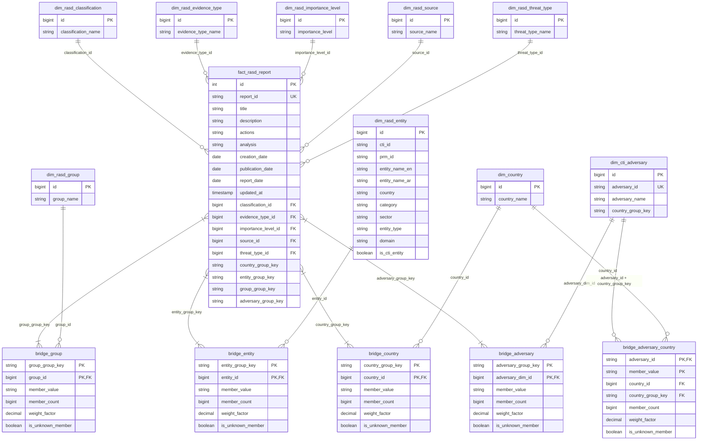

# CTI / RASD — Data Model

This document covers the data model in the `cti_gold` schema: the entity-relationship diagram, the model tables and the semantic layer.

## 1. Entity-Relationship Diagram

## 2. Model Tables

### 2.1 Fact

#### fact_rasd_report

One row per RASD report.

| Column | Data Type | Description |
|---|---|---|
| id | INT | Report surrogate key. |
| report_id | STRING | RASD report identifier. |
| title | STRING | Report title. |
| description | STRING | Report description. |
| actions | STRING | Recommended or taken actions. |
| analysis | STRING | Analyst assessment. |
| creation_date | DATE | Date the report was created. |
| publication_date | DATE | Date the report was published. |
| report_date | DATE | Report observation date. |
| updated_at | TIMESTAMP | Last update time in the source. |
| classification_id | BIGINT | Reference to dim_rasd_classification. |
| evidence_type_id | BIGINT | Reference to dim_rasd_evidence_type. |
| importance_level_id | BIGINT | Reference to dim_rasd_importance_level. |
| source_id | BIGINT | Reference to dim_rasd_source. |
| threat_type_id | BIGINT | Reference to dim_rasd_threat_type. |
| country_group_key | STRING | Key of the report's country set in bridge_country. |
| entity_group_key | STRING | Key of the report's entity set in bridge_entity. |
| group_group_key | STRING | Key of the report's threat group set in bridge_group. |
| adversary_group_key | STRING | Key of the report's adversary set in bridge_adversary. |

### 2.2 Dimensions

#### dim_rasd_classification

Report classifications.

| Column | Data Type | Description |
|---|---|---|
| id | BIGINT | Classification surrogate key. |
| classification_name | STRING | Classification name. |

#### dim_rasd_evidence_type

Types of supporting evidence.

| Column | Data Type | Description |
|---|---|---|
| id | BIGINT | Evidence type surrogate key. |
| evidence_type_name | STRING | Evidence type name. |

#### dim_rasd_importance_level

Report importance levels.

| Column | Data Type | Description |
|---|---|---|
| id | BIGINT | Importance level surrogate key. |
| importance_level | STRING | Importance level name. |

#### dim_rasd_source

Observation sources.

| Column | Data Type | Description |
|---|---|---|
| id | BIGINT | Source surrogate key. |
| source_name | STRING | Source name. |

#### dim_rasd_threat_type

Threat categories.

| Column | Data Type | Description |
|---|---|---|
| id | BIGINT | Threat type surrogate key. |
| threat_type_name | STRING | Threat type name. |

#### dim_rasd_group

Threat groups named in reports.

| Column | Data Type | Description |
|---|---|---|
| id | BIGINT | Threat group surrogate key. |
| group_name | STRING | Threat group name. |

#### dim_country

Countries shared by reports and adversaries.

| Column | Data Type | Description |
|---|---|---|
| id | BIGINT | Country surrogate key. |
| country_name | STRING | Country name. |

#### dim_rasd_entity

Organizations referenced in reports.

| Column | Data Type | Description |
|---|---|---|
| id | BIGINT | Entity surrogate key. |
| cti_id | STRING | Entity identifier in the CTI register. |
| prm_id | STRING | Entity identifier in PRM. |
| entity_name_en | STRING | Entity name in English. |
| entity_name_ar | STRING | Entity name in Arabic. |
| country | STRING | Country of the entity. |
| category | STRING | Entity category. |
| sector | STRING | Entity sector. |
| entity_type | STRING | Entity type. |
| domain | STRING | Entity web domain. |
| is_cti_entity | BOOLEAN | True when the entity exists in the CTI register. |

#### dim_cti_adversary

Adversaries from CTI.

| Column | Data Type | Description |
|---|---|---|
| id | BIGINT | Adversary surrogate key. |
| adversary_id | STRING | Adversary identifier in CTI. |
| adversary_name | STRING | Adversary name. |
| country_group_key | STRING | Key of the adversary's target country set in bridge_adversary_country. |

### 2.3 Bridges

#### bridge_country

Links report country sets to countries.

| Column | Data Type | Description |
|---|---|---|
| country_group_key | STRING | Key of the report's country set. |
| country_id | BIGINT | Reference to dim_country. |
| member_value | STRING | Country value from the report. |
| member_count | BIGINT | Number of countries in the set. |
| weight_factor | DECIMAL | Share of the report assigned to this country. |
| is_unknown_member | BOOLEAN | True when the country is missing or unmatched. |

#### bridge_entity

Links report entity sets to entities.

| Column | Data Type | Description |
|---|---|---|
| entity_group_key | STRING | Key of the report's entity set. |
| entity_id | BIGINT | Reference to dim_rasd_entity. |
| member_value | STRING | Entity value from the report. |
| member_count | BIGINT | Number of entities in the set. |
| weight_factor | DECIMAL | Share of the report assigned to this entity. |
| is_unknown_member | BOOLEAN | True when the entity is missing or unmatched. |

#### bridge_group

Links report threat group sets to threat groups.

| Column | Data Type | Description |
|---|---|---|
| group_group_key | STRING | Key of the report's threat group set. |
| group_id | BIGINT | Reference to dim_rasd_group. |
| member_value | STRING | Threat group value from the report. |
| member_count | BIGINT | Number of threat groups in the set. |
| weight_factor | DECIMAL | Share of the report assigned to this group. |
| is_unknown_member | BOOLEAN | True when the group is missing or unmatched. |

#### bridge_adversary

Links report adversary sets to CTI adversaries.

| Column | Data Type | Description |
|---|---|---|
| adversary_group_key | STRING | Key of the report's adversary set. |
| adversary_dim_id | BIGINT | Reference to dim_cti_adversary. |
| member_value | STRING | Adversary identifier linked to the report. |
| member_count | BIGINT | Number of adversaries in the set. |
| weight_factor | DECIMAL | Share of the report assigned to this adversary. |
| is_unknown_member | BOOLEAN | True when no adversary is linked or it is unmatched. |

#### bridge_adversary_country

Links CTI adversaries to the countries they target.

| Column | Data Type | Description |
|---|---|---|
| country_group_key | STRING | Key of the adversary's target country set. |
| adversary_id | STRING | Adversary identifier in CTI. |
| country_id | BIGINT | Reference to dim_country. |
| member_value | STRING | Country value from the adversary record. |
| member_count | BIGINT | Number of countries targeted by the adversary. |
| weight_factor | DECIMAL | Share of the adversary assigned to this country. |
| is_unknown_member | BOOLEAN | True when the country is unmatched. |

## 3. Semantic Layer

### vw_report

One row per RASD report, with its classification attributes shown as labels.

| Column | Data Type | Description |
|---|---|---|
| id | INT | Report surrogate key. |
| report_id | STRING | RASD report identifier. |
| title | STRING | Report title. |
| description | STRING | Report description. |
| actions | STRING | Recommended or taken actions. |
| analysis | STRING | Analyst assessment. |
| creation_date | DATE | Date the report was created. |
| publication_date | DATE | Date the report was published. |
| report_date | DATE | Report observation date. |
| updated_at | TIMESTAMP | Last update time in the source. |
| classification | STRING | Report classification. |
| evidence_type | STRING | Type of supporting evidence. |
| importance | STRING | Importance level. |
| observation_source | STRING | Source of the observation. |
| threat_type | STRING | Threat category. |
| country_group_key | STRING | Key of the report's country set. |
| entity_group_key | STRING | Key of the report's entity set. |
| group_group_key | STRING | Key of the report's threat group set. |
| adversary_group_key | STRING | Key of the report's adversary set. |

### vw_report_country

One row per report and country.

| Column | Data Type | Description |
|---|---|---|
| report_id | STRING | RASD report identifier. |
| title | STRING | Report title. |
| report_date | DATE | Report observation date. |
| classification | STRING | Report classification. |
| importance | STRING | Importance level. |
| threat_type | STRING | Threat category. |
| country_id | BIGINT | Country surrogate key. |
| country_name | STRING | Country name. |
| weight_factor | DECIMAL | Share of the report assigned to this country. |
| is_unknown_member | BOOLEAN | True when the country is missing or unmatched. |

### vw_report_entity

One row per report and entity.

| Column | Data Type | Description |
|---|---|---|
| report_id | STRING | RASD report identifier. |
| title | STRING | Report title. |
| report_date | DATE | Report observation date. |
| classification | STRING | Report classification. |
| importance | STRING | Importance level. |
| threat_type | STRING | Threat category. |
| entity_id | BIGINT | Entity surrogate key. |
| entity_name_en | STRING | Entity name in English. |
| entity_name_ar | STRING | Entity name in Arabic. |
| cti_id | STRING | Entity identifier in the CTI register. |
| prm_id | STRING | Entity identifier in PRM. |
| sector | STRING | Entity sector. |
| category | STRING | Entity category. |
| entity_type | STRING | Entity type. |
| entity_country | STRING | Country of the entity. |
| is_cti_entity | BOOLEAN | True when the entity exists in the CTI register. |
| weight_factor | DECIMAL | Share of the report assigned to this entity. |
| is_unknown_member | BOOLEAN | True when the entity is missing or unmatched. |

### vw_report_group

One row per report and threat group.

| Column | Data Type | Description |
|---|---|---|
| report_id | STRING | RASD report identifier. |
| title | STRING | Report title. |
| report_date | DATE | Report observation date. |
| classification | STRING | Report classification. |
| importance | STRING | Importance level. |
| threat_type | STRING | Threat category. |
| group_id | BIGINT | Threat group surrogate key. |
| group_name | STRING | Threat group name. |
| weight_factor | DECIMAL | Share of the report assigned to this group. |
| is_unknown_member | BOOLEAN | True when the group is missing or unmatched. |

### vw_report_adversary

One row per report and CTI adversary.

| Column | Data Type | Description |
|---|---|---|
| report_id | STRING | RASD report identifier. |
| title | STRING | Report title. |
| report_date | DATE | Report observation date. |
| classification | STRING | Report classification. |
| importance | STRING | Importance level. |
| threat_type | STRING | Threat category. |
| adversary_id | BIGINT | Adversary surrogate key. |
| adversary_name | STRING | Adversary name. |
| weight_factor | DECIMAL | Share of the report assigned to this adversary. |
| is_unknown_member | BOOLEAN | True when no adversary is linked or it is unmatched. |

### vw_adversary_target_country

One row per CTI adversary and target country.

| Column | Data Type | Description |
|---|---|---|
| adversary_id | STRING | Adversary identifier in CTI. |
| adversary_name | STRING | Adversary name. |
| country_group_key | STRING | Key of the adversary's target country set. |
| country_id | BIGINT | Country surrogate key. |
| country_name | STRING | Target country name. |
| weight_factor | DECIMAL | Share of the adversary assigned to this country. |
| is_unknown_member | BOOLEAN | True when the country is unmatched. |
| total_targeted_countries | BIGINT | Number of countries targeted by the adversary. |

### vw_entity_coverage

One row per entity coverage metric.

| Column | Data Type | Description |
|---|---|---|
| metric | STRING | Metric name. |
| value | BIGINT | Metric value. |
